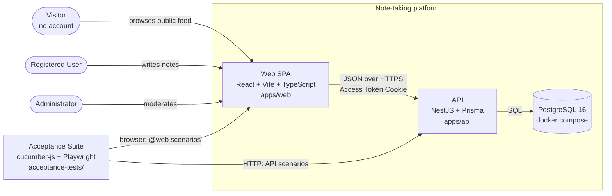
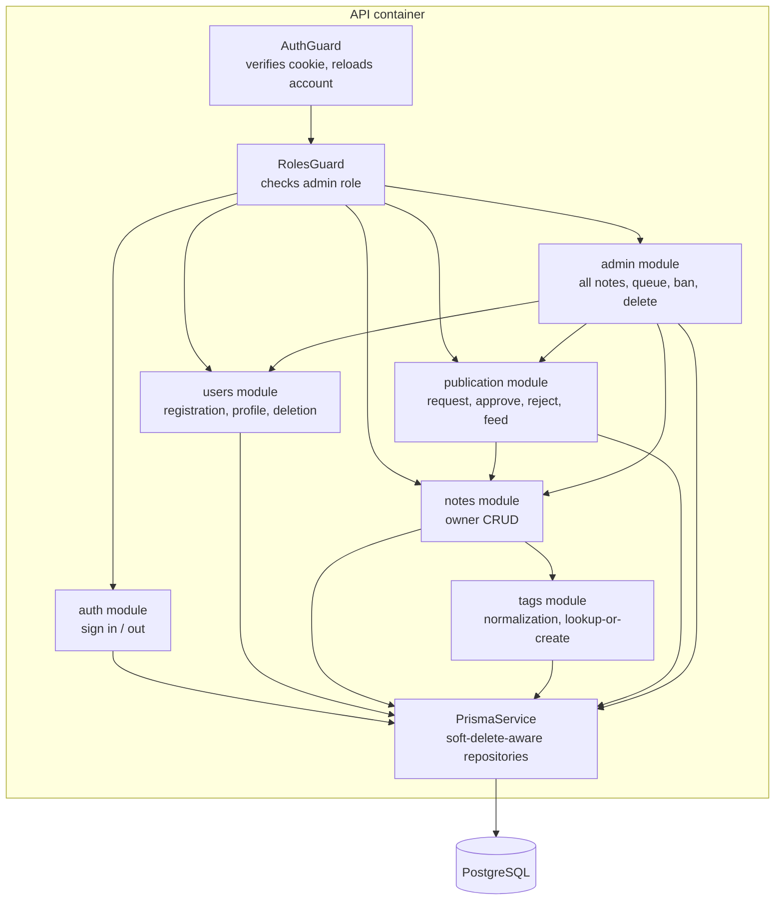
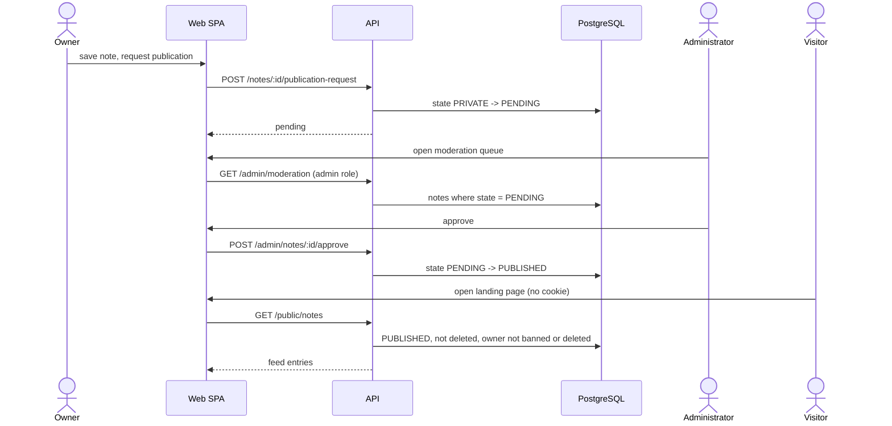

## Context

The repository holds an OpenSpec template and no application code. Everything in this design is
greenfield: there is no existing schema, no running service and no deployment to preserve.

`adr/` does not exist yet, so **no ADR is currently in force** and no prior architectural commitment
constrains these choices. The decisions below are the first ones this repository will record.

The behaviour being designed is fixed by the eight capability specs in this change. The interesting
constraints they impose are: a **Ban** must take effect on the next request; a **Soft Delete** must
release an email and user name for reuse; the **Public Feed** must be anonymous; a **Note**'s content
must be re-moderated after an edit; and every scenario in every `spec.md` must be executable by one
**Acceptance Suite**.

### Container view



### Component view — the API container



The **Public Feed** routes are the only ones that bypass `AuthGuard`; everything else passes through it.

### Dynamic view — a Note reaching the Public Feed



**Assumptions**, since nothing is built yet: a single API instance and a single database; no CDN, cache
or queue; local Docker is the only deployment target; the SPA is served by Vite in development and as
static files otherwise.

## Goals / Non-Goals

**Goals:**

- One coherent authorization model: **Owner**-only by default, **Administrator** as the single
  exception, anonymous only on the **Public Feed**.
- **Ban** and account deletion observable on the next request, not at token expiry.
- **Soft Delete** everywhere, with a deleted identity genuinely reusable.
- Every scenario in every `spec.md` executed by one command with one HTML report.
- A schema and module layout a reader can hold in their head, since the point of the exercise is to
  practise the OpenSpec lifecycle rather than to build a large system.

**Non-Goals:**

- Email verification, password reset, refresh tokens, and rate limiting.
- Restoring or purging soft-deleted records.
- Full-text search, note sharing with named people, comments, or revision history.
- Horizontal scaling, caching, background jobs, and any hosted deployment.
- Real-time updates; the **Moderation Queue** is polled by navigation, not pushed.

## Decisions

### D1 — pnpm workspace with a Vite SPA, not Next.js

`apps/api`, `apps/web`, `packages/shared` under pnpm workspaces. `packages/shared` holds the DTO types
both sides import, so the contract is checked by the compiler rather than by hand.

*Alternatives:* Next.js would give server rendering for the **Public Feed**, which is genuinely nice for
sharing links — but it adds a second Node server, and a session model split between server components
and the browser. Two unlinked npm projects were rejected because the API types would be duplicated.

### D2 — JWT in an httpOnly cookie, no refresh token

Sign-in sets an httpOnly, `SameSite=Lax`, `Secure`-in-production cookie holding a JWT with a one hour
lifetime. There is no refresh token; expiry means signing in again. Page scripts cannot read the
cookie, so an XSS on a rendered **Note** cannot exfiltrate a session.

CSRF: `SameSite=Lax` already withholds the cookie from cross-site non-GET requests, and no state changes
behind a GET. As defence in depth, mutating requests must carry an `Origin` matching the configured web
origin, or be refused.

*Alternatives:* a bearer token in `localStorage` is simpler but readable by any injected script, which is
a poor fit for a product that renders attacker-supplied markdown. An access/refresh pair is the
production answer and roughly doubles the auth surface; it can supersede this decision later.

### D3 — The guard reloads the Account on every request

`AuthGuard` verifies the JWT, then loads the **Account** by primary key and refuses it when
`bannedAt` or `deletedAt` is set. This is what makes "banned immediately" true rather than "banned
within an hour", and it makes account deletion behave the same way.

*Alternative:* trusting the token's claims avoids the query but leaves a banned person working for up
to an hour, which no honest scenario could describe. The cost is one indexed primary-key lookup per
request, which this system will never notice.

### D4 — argon2id for password hashing

`argon2` with the id variant and library defaults. Memory-hard, and the current recommendation over
bcrypt's 72-byte input limit and lower memory cost. Hashes are never selected into a DTO; the users
service projects explicit fields.

### D5 — Soft delete by explicit filters in repositories, not a global Prisma extension

Every read path filters `deletedAt: null` explicitly, concentrated in per-entity repository methods that
the modules call. No global Prisma client extension rewrites queries.

*Alternative:* a client extension that injects the filter everywhere is less repetitive, but it silently
changes the meaning of every query, is awkward for nested reads and relation counts, and makes the one
place that legitimately needs deleted rows hard to write. Explicit filters are more typing and are
covered by a scenario on each read path in `platform-foundation`.

### D6 — Uniqueness scoped to Live Rows via partial unique indexes

`email` and `user_name` are unique only where `deleted_at IS NULL`. Prisma's schema language cannot
express a partial index, so the migration adds them as raw SQL:

```sql
CREATE UNIQUE INDEX users_email_live_key    ON users (email)     WHERE deleted_at IS NULL;
CREATE UNIQUE INDEX users_user_name_live_key ON users (user_name) WHERE deleted_at IS NULL;
```

*Alternative:* rewriting the email on delete (`priya@example.com` → `deleted-17-priya@example.com`) keeps
a plain unique constraint but corrupts the record it claims to preserve.

### D7 — Publication as an enum state machine, with edit returning a Note to pending

`Note.publicationState` is `PRIVATE | PENDING | PUBLISHED`, with `rejectionReason` holding the most
recent **Administrator** decision. The transitions are `PRIVATE → PENDING` (**Owner** requests),
`PENDING → PUBLISHED` (approve), `PENDING → PRIVATE` (reject, with reason), `PUBLISHED → PRIVATE`
(withdraw), and `PUBLISHED → PENDING` (content edited).

That last transition is the one worth defending: without it, publishing acceptable content and then
replacing the body would put unmoderated content on an anonymous page. Only content changes trigger it;
withdrawing does not.

*Alternative:* a boolean `isPublic` cannot express "waiting for a decision", and a separate
`publication_requests` table would model a history nobody has asked to read.

### D8 — Public Feed filters on the owner, in one query

The feed is `publicationState = PUBLISHED AND note.deletedAt IS NULL AND owner.bannedAt IS NULL AND
owner.deletedAt IS NULL`, expressed as a single Prisma query with a relation filter. **Ban** therefore
hides notes by omission, with nothing to undo on unban.

*Alternative:* denormalising a `visible` flag onto the note would need every ban, unban, delete and
state change to maintain it, and would drift.

### D9 — One normalization function, a unique Tag name, and upsert

`normalizeTag(input)` — trim, lowercase, collapse whitespace runs to `-`, then assert
`^[a-z0-9-]{1,32}$` — is the single entry point. Note writes map input through it and `upsert` on the
unique `name`. **Tags** are never soft-deleted and orphans are retained, so no cleanup path can race
with a soft-deleted **Note** that still references a **Tag**.

### D10 — Markdown rendered with react-markdown and rehype-sanitize, raw HTML disabled

The **Public Feed** renders text written by one person to an audience of anonymous strangers, so
`rehype-raw` is never installed and `rehype-sanitize` runs with the default schema. Sanitization happens
at render time rather than on write, so the stored **Note** stays exactly what its **Owner** typed.

### D11 — One Acceptance Suite; web scenarios selected by profile, not by tag

`acceptance-tests/` is a single cucumber-js project. Its hooks start PostgreSQL, run migrations and the
seed, boot the API, and boot Vite before the suite. API scenarios use the HTTP world the skill pack
ships; `web-client` scenarios use Playwright-backed page objects behind the same intent-level steps.

Selection is by cucumber **profile with explicit paths** (`.extracted/**/web-client/**`) rather than by
`@web` tags: the `spec.md` fences carry only Given/When/Then steps, so there is nowhere to put a tag
without inventing a convention the extractor may not honour.

Each scenario starts from a truncated database re-seeded with the **Seed Administrator**, so scenarios
can run in any order and no scenario depends on another's leftovers.

### D12 — REST shape

`/api/v1` for authenticated routes, `/api/v1/public/...` for the anonymous **Public Feed**,
`/api/v1/admin/...` for everything gated on the admin **Role**. Lists take `page` and `limit`
(default 20, maximum 100) plus the optional `tag` filter. The prefix separation means the guard
configuration mirrors the URL structure, which is one less thing to get wrong.

## Risks / Trade-offs

- **A known weak credential (`hans.admin` / `p@assw0rt`) exists in every environment by construction**
  → the seed reads the password from `SEED_ADMIN_PASSWORD`, defaulting to `p@assw0rt` for local work,
  and the deployment notes state plainly that this platform is local-only until that default is
  removed. This is the sharpest risk in the change and it is accepted deliberately, not overlooked.
- **Per-request account lookup adds a query to every authenticated call** → a primary-key lookup on a
  small table; revisit only if a real load profile ever appears.
- **Partial unique indexes live in hand-written SQL, outside the Prisma schema** → a future
  `prisma migrate dev` could generate a migration that does not know about them. The identity-reuse
  scenario in `user-accounts` fails loudly if they are lost.
- **Explicit soft-delete filters can be forgotten on a new read path** → every read path named in the
  specs has a scenario asserting deleted records are absent; new read paths must arrive with one.
- **Playwright makes the suite slower and more prone to flake than an HTTP-only suite** → web scenarios
  stay few and intent-level, page objects wait on visible state rather than on timeouts, and retries are
  not enabled, so a flake is reported instead of hidden.
- **Sending an edited published Note back to pending will surprise owners** → the editor warns before
  saving a published **Note**, and the note list shows the state on every row.
- **Soft-deleted rows accumulate forever** → accepted; purging is a non-goal and would need its own
  change with its own retention decision.
- **`packages/shared` types are a compile-time contract only** → the **Acceptance Suite** is what
  actually proves the API behaves as the SPA expects.

## Migration Plan

Greenfield, so there is no data migration and nothing to preserve.

1. `docker compose up -d db` brings up PostgreSQL with a named volume.
2. `pnpm --filter api prisma migrate deploy` applies the schema, including the raw-SQL partial indexes.
3. `pnpm --filter api prisma db seed` inserts the **Seed Administrator** idempotently — safe to re-run.
4. `pnpm dev` runs the API and Vite together; `pnpm test:acceptance` runs the suite against a database
   it truncates and re-seeds per scenario.

Rollback during development is `docker compose down -v` followed by a re-run of steps 1–3. There is no
production environment to roll back.

## Open Questions

- No ADR is in force, so nothing needs superseding. D2 (cookie JWT, no refresh token) and D5 (explicit
  soft-delete filters) are the two most likely to be revisited; each says what would replace it.
- Should a rejected **Note** keep a history of rejection reasons rather than only the most recent one?
  Deferred: no scenario needs it, and adding a table later is cheap.
- Should the **Moderation Queue** be paginated? It uses the same defaults as every other list, which is
  assumed sufficient until someone runs the platform with a real backlog.
- Should the **Public Feed** show the **Owner**'s user name? The specs do not say, and the answer decides
  whether banning is publicly observable. Implemented as showing the user name unless the specs are
  changed.
